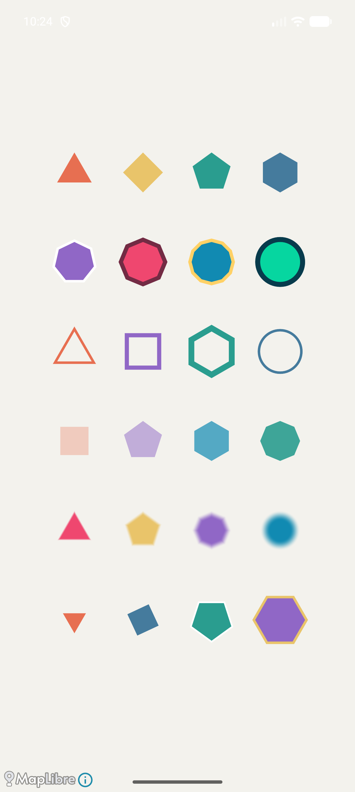

> [!WARNING]
> This repository was scaffolded by AI and contains AI-generated source code.

# MapLibre Native Android plugin example

A small Android app that builds the n-gon layer plugin against the **published SDK from Maven Central** and renders a triangle, pentagon, and octagon. The style and GeoJSON are bundled with the app, so the demo works offline.



## Published SDK

Both modules use this exact dependency:

```kotlin
implementation("org.maplibre.gl:android-sdk:13.6.1-pre935d410353da9d701ad42c97f2e0c300c8d408b8")
```

The [release](https://github.com/maplibre/maplibre-native/releases/tag/android-v13.6.1-pre935d410353da9d701ad42c97f2e0c300c8d408b8) is available in [Maven Central](https://repo.maven.apache.org/maven2/org/maplibre/gl/android-sdk/13.6.1-pre935d410353da9d701ad42c97f2e0c300c8d408b8/). This `android-sdk` publication uses **Vulkan**. Its AAR includes `prefab/modules/maplibre/include/mln/plugin/plugin_api.h` and exports `mln_plugin_register_v1` from `libmaplibre.so`.

There is no local SDK dependency substitution, vendored plugin API header, or dependency on a MapLibre Native checkout. The native n-gon implementation and shader generator were copied from the release commit `935d410353da9d701ad42c97f2e0c300c8d408b8`, keeping them compatible with the published API. See [LICENSE.md](LICENSE.md).

## Build and run

Requirements:

- JDK 17 or newer compatible with Gradle 9.5.1 (verified with Android Studio's JDK 21).
- Android SDK platform 35 and the SDK build tools selected by Android Gradle Plugin 9.1.1.
- Android NDK `28.2.13676358` and CMake `3.22.1`, available through Android Studio's SDK Manager.
- Node.js on `PATH` for shader generation (verified with Node.js 26.8.1).
- A Vulkan-capable Android device or emulator, API 23 or newer.

Open this directory in Android Studio and run the `app` configuration, or set `ANDROID_HOME` / create an ignored `local.properties` with `sdk.dir=/path/to/Android/sdk`, then run:

```sh
./gradlew :app:assembleDebug :ngon-layer:assembleRelease :app:lintDebug
./gradlew :app:installDebug
adb shell am start -n org.maplibre.plugins.demo/.MainActivity
```

Outputs:

- App: `app/build/outputs/apk/debug/app-debug.apk`
- Plugin: `ngon-layer/build/outputs/aar/ngon-layer-release.aar`

The plugin AAR contains `libngon-plugin.so` for `arm64-v8a`, `armeabi-v7a`, `x86`, and `x86_64`. Consumers also need the compatible MapLibre SDK dependency; the plugin AAR does not bundle the SDK.

## How the plugin connects

1. `ngon-layer` enables Prefab and uses `find_package(MapLibreAndroid REQUIRED CONFIG)` to compile against the public C header in the Maven AAR.
2. Its CMake build generates shaders and builds the plugin separately, using a static C++ runtime.
3. The app initializes MapLibre, then calls `NgonLayer.register()` before loading its style.
4. The JNI bridge uses `dlopen(..., RTLD_NOLOAD)` and `dlsym` to find `mln_plugin_register_v1` in the already-loaded SDK and registers the plugin's callbacks. Registration also accepts the already-registered result when an activity is recreated.
5. [ngon.json](app/src/main/assets/ngon.json) selects `"type": "ngon"` and uses feature expressions for polygon corners and colors. Plugin layers currently load through style JSON rather than Java `Layer` peers.

The public C ABI is experimental. Keep the plugin implementation and SDK version compatible when upgrading. This example targets the single-renderer `android-sdk` artifact; a multi-backend integration must register with the selected renderer's library.

## Create your own plugin

Try giving your coding assistant a prompt like this:

```text
Could you scaffold an Android app that imports
org.maplibre.gl:android-sdk:13.6.1-pre935d410353da9d701ad42c97f2e0c300c8d408b8
from Maven Central? Please check that it exists first. I want to create a
MapLibre Native plugin that draws striped polygon markers. You can use the
plugin API and n-gon example in
https://github.com/louwers/maplibre-native-plugin-android-example as a reference.
Compile against the public plugin header included in the SDK's Prefab package.
Add a simple offline style showing the plugin, build it, and run it on an
Android emulator. Include a screenshot and build instructions in the README.
```

## Verification

Verified on October 1, 2026:

- Maven Central metadata, POM, AAR, and Gradle module metadata exist for the exact version.
- Gradle resolves that Maven version for both modules; CMake uses its published Prefab header.
- Debug APK and release plugin AAR build for all four ABIs.
- Android lint completes with zero errors (seven advisory warnings).
- The app launches on the `Pixel_10_Pro` arm64 emulator, Android API 37, loads the plugin style, and visibly renders all three polygons. The screenshot above comes from that run. Other ABIs were build-checked only.

To inspect the resolved SDK:

```sh
./gradlew :app:dependencyInsight \
  --dependency org.maplibre.gl:android-sdk \
  --configuration debugRuntimeClasspath
```
